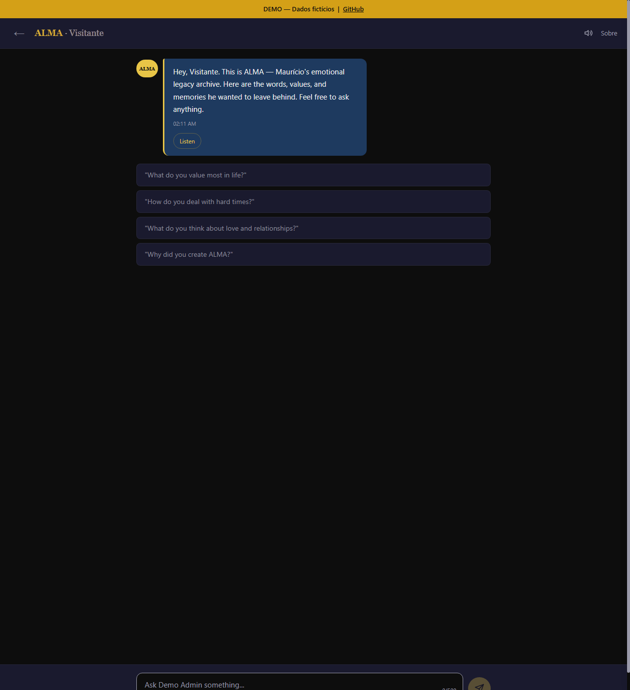

<p align="center">
  
</p>

<p align="center">
  <a href="https://alma-demo.netlify.app"></a>
  <a href="https://projeto-alma.netlify.app"></a>
</p>

<p align="center">
  <a href="LICENSE"></a>
  
  
  
  
  
  
  
</p>

<p align="center">
  <a href="README.pt-BR.md">Leia em Portugues</a> ·
  <a href="README.es.md">Leer en Espanol</a> ·
  <a href="https://alma-demo.netlify.app">Try the Demo</a> ·
  <a href="#quick-start">Quick Start</a>
</p>

---

<p align="center">
  
  <br>
  <em>ALMA welcomes a visitor with the author's words, values, and memories — ready for real conversation.</em>
</p>

---

## What is ALMA?

ALMA is a platform that lets you preserve your voice, values, and memories for the people you love — so they can talk to you even when you're no longer there.

It's not a chatbot. It's not a memorial page. It's a living archive of who you are, powered by RAG (Retrieval-Augmented Generation) and AI, that your children, partner, parents, or friends can have real conversations with — and hear answers that sound like you, because they're built from your own words.

**Think of it as a backup of your soul.**

### Try it now

> **[alma-demo.netlify.app](https://alma-demo.netlify.app)** — Login: `Lucas` / `demo123`
>
> The demo uses fictional data (a character named Rafael Mendes). No real personal information.

---

## Why ALMA Exists

> *"Almost 20 years. And I still wish I could talk to him when I need to make a hard decision."*

That's what Marila said. Her father died twenty years ago. She's a grown woman now. She makes hard choices. She opens her phone. And silence answers.

She doesn't have his voice explaining how he thought. She doesn't have his mistakes documented, his faith recorded, his reasoning preserved. Her father left before anyone thought to save those things.

**He arrived too late. ALMA arrived too late for him.**

But not for everyone.

---

ALMA was built by a father — a police chief in Brazil who grew up with an absent, alcoholic father and broke the cycle. He raised three sons with a kind of presence he never received. Then he realized: **presence has an expiration date.**

So he started writing. He produced over 1,100 memories — more than 150,000 words across 14 categories — documenting everything: his values, his mistakes, his faith, his fears, what he learned about love, about pain, about being a man. Raw. Unfiltered. Real.

Then he built ALMA — over 12,000 lines of code with only 3 dependencies — a system where his sons can ask him anything, anytime, and get answers rooted in his actual words and memories. Not generic AI responses. **His voice.**

Then he gave it to the world.

> ALMA is not an archive. It's not a diary. It's not technology.
>
> **ALMA is presence that doesn't die.**

**ALMA is free. ALMA is open source. Because every father, every mother, every person who wants to leave something real behind deserves the tools to do it.**

**Don't wait until it's too late.**

---

## What Makes ALMA Different

| Feature | ALMA | Typical "memorial" tools |
|---|---|---|
| **Conversations** | Real-time AI chat based on your actual words | Pre-recorded video clips |
| **Age-aware** | Adapts vocabulary and depth to child's current age (6 tiers) | Same content for everyone |
| **Context-aware** | Adapts tone per person (child vs. partner vs. parent) | No personalization |
| **Self-correcting** | Author can correct AI responses in real-time | Static, no feedback loop |
| **Content moderation** | AI-powered moderation on all user inputs | None |
| **Dead man's switch** | Automatic inheritance activation when author stops checking in | Manual will/testament |
| **Searchable memory** | Multi-phase RAG search with 7-tier reranking | Manual browsing only |
| **Directive system** | Per-person behavioral rules for the AI | No customization |
| **Multi-language** | i18n ready (PT-BR, EN, ES — add your own) | Single language |
| **Voice** | ElevenLabs TTS — hear the author's cloned voice | Text only |
| **Mobile capture** | 1-tap voice → database via Termux | Desktop upload only |
| **Free & open** | MIT License, zero cost to run | $100+/month subscriptions |
| **Self-hosted** | Your data stays yours (Netlify + Neon free tier) | Vendor lock-in |

---

## Age-Aware Responses

ALMA calculates each person's age from their birth date and automatically adapts vocabulary, depth, and emotional weight:

| Age | Tier | How ALMA speaks |
|---|---|---|
| 0–7 | Small child | Very simple, short, playful. Comparisons to superheroes, animals. Max 2 paragraphs. |
| 8–12 | Child | Introduces values through stories and concrete examples. Accessible, warm. |
| 13–15 | Young teen | Respects intelligence. Validates feelings. No lectures — real conversation. |
| 16–17 | Teenager | Near-adult treatment. Shares vulnerabilities. Honest about mistakes. |
| 18–25 | Young adult | Peer-level wisdom. No sugar-coating. Hard lessons, real regrets. |
| 25+ | Adult | Complete honesty. Raw truth. No protective filter. |

The same question — *"Did you ever make a mistake?"* — gets radically different answers for a 5-year-old ("Everyone makes mistakes, even Dad") vs. a 25-year-old (the full, unfiltered truth).

---

## Dead Man's Switch

ALMA includes an inheritance system that activates automatically:

1. **Author checks in** periodically via heartbeat (web or Termux `alma-checkin`)
2. **If check-ins stop**, the system escalates:
   - **1x interval**: Warning alert saved to database
   - **2x interval**: Critical alert — emails sent to heirs
   - **3x interval**: Legacy mode activated — heirs can unlock with personal passphrases
3. **Each heir gets**: a personal passphrase, a personal message from the author, and an access level (`owner`, `admin`, or `read`)
4. **The technical heir** (e.g., a sibling) gets admin access to maintain the system

No one needs to "turn on" the inheritance. It activates itself when it's needed.

---

## How It Works

```
┌──────────────┐     ┌──────────────┐     ┌──────────────┐
│   Your Son   │────▶│  ALMA Chat   │────▶│  Claude AI   │
│  asks a      │     │  (Frontend)  │     │  (Anthropic) │
│  question    │     └──────┬───────┘     └──────▲───────┘
└──────────────┘            │                    │
                            ▼                    │
                   ┌──────────────┐     ┌──────────────┐
                   │   Netlify    │────▶│   RAG Engine  │
                   │  Functions   │     │  Search your  │
                   │  (Backend)   │     │  memories in  │
                   └──────────────┘     │  Neon DB      │
                                        └──────────────┘
```

### The RAG Pipeline

1. **Someone asks a question** — "Dad, what do I do when I feel like I'm not enough?"
2. **Query expansion** — Claude Haiku generates 3–5 semantic keywords (cached 24h)
3. **Multi-phase search** — Full-text search → tag-based fallback → trigram fuzzy matching → person guarantee
4. **7-tier reranking** — Boosts by person tag, category match, parenting context, core identity, language, recency, and term overlap
5. **Context assembly** — Pulls relevant memories + corrections + directives + tone config + age adaptation
6. **AI responds as you** — Using your actual words as foundation, not generic responses
7. **You can correct it** — If the AI gets your voice wrong, correct it. ALMA learns.

---

## Quick Start

ALMA runs on free infrastructure. You can deploy your own instance in under 30 minutes.

### Prerequisites

- A [Netlify](https://netlify.com) account (free tier)
- A [Neon](https://neon.tech) PostgreSQL database (free tier)
- An [Anthropic](https://anthropic.com) API key (for Claude AI)
- Node.js 18+

### Setup

```bash
# 1. Clone the repository
git clone https://github.com/mauriciompj/alma.git
cd alma

# 2. Install dependencies
npm install

# 3. Configure environment
cp .env.example .env
# Edit .env with your DATABASE_URL and ANTHROPIC_API_KEY

# 4. Initialize the database
node db/run-seed.mjs

# 5. Deploy to Netlify
npx netlify-cli deploy --prod --dir=. --functions=netlify/functions
```

### First Steps After Deploy

1. Open your ALMA site
2. Log in as admin
3. Start adding your memories — write about your values, your stories, your mistakes, your love
4. Share the login with the people you want to talk to
5. Correct the AI when it doesn't sound like you — ALMA learns from every correction

---

## Architecture

```
alma/
├── index.html                  # Dashboard / person selector
├── chat.html                   # Chat interface
├── admin.html                  # Admin panel (memories, corrections, directives)
├── login.html                  # Authentication with i18n
├── revisor.html                # Visual chunk reviewer
├── setup.html                  # Initial setup wizard
├── sobre.html                  # About ALMA page
├── legacy.html                 # Inheritance access (passphrase unlock)
├── css/
│   ├── style.css               # Main styles (dark theme, responsive)
│   └── admin.css               # Admin panel styles
├── js/
│   ├── alma.js                 # Main entry point + initialization
│   ├── i18n.js                 # Internationalization system
│   └── modules/
│       ├── state.js            # Centralized shared state
│       ├── api.js              # Backend HTTP communication
│       ├── chat.js             # Chat UI, message rendering
│       ├── corrections.js      # AI-powered correction modal
│       ├── directives.js       # Behavioral rules panel
│       ├── history.js          # Conversation persistence
│       ├── ui.js               # DOM utilities, markdown, XSS escaping
│       └── voice.js            # ElevenLabs TTS with caching
├── netlify/
│   └── functions/
│       ├── auth.mjs            # Auth with bcrypt + auto-migration
│       ├── chat.mjs            # RAG engine with 7-tier reranking
│       ├── memories.mjs        # Memory CRUD + corrections + directives + moderation
│       ├── ingest.mjs          # Quick capture API (mobile/Termux)
│       ├── alma-voice.mjs      # ElevenLabs text-to-speech proxy
│       ├── legacy.mjs          # Inheritance system + heartbeat
│       ├── heartbeat-check.mjs # Scheduled dead man's switch
│       └── lib/
│           ├── auth.mjs        # Shared auth (sessions, rate limiting, CORS)
│           ├── constants.mjs   # Centralized configuration
│           └── rag.mjs         # Search, reranking, token budget
├── tools/                      # 12 Termux/Android shell scripts
│   ├── alma-send               # Send text/files to ALMA
│   ├── alma-quick              # 1-tap voice capture widget
│   ├── alma-record             # Record audio + transcribe + send
│   ├── alma-voice              # Speech-to-text + confirm + send
│   ├── alma-checkin            # Heartbeat check-in (dead man's switch)
│   ├── alma-setup.sh           # Termux installation script
│   ├── alma-lib.sh             # Shared library (auth, config)
│   ├── alma_voz.sh             # Tasker bridge: Google Assistant → ALMA
│   ├── termux-url-opener       # Android Share: receive text
│   ├── termux-file-receiver    # Android Share: receive files
│   └── termux-file-editor      # Android Share: convert + send (PDF, DOCX, audio)
├── locales/
│   ├── en.json                 # English
│   ├── es.json                 # Spanish
│   └── pt-BR.json              # Portuguese (Brazil)
├── db/
│   ├── seed.sql                # Database schema (6 tables, 20 indexes, 2 triggers)
│   ├── migration-v4-trgm.sql   # Trigram fuzzy search extension
│   ├── run-seed.mjs            # Schema runner
│   ├── seed-demo.sql           # Demo data (fictional)
│   ├── run-seed-demo.mjs       # Demo seeder
│   ├── import-json.mjs         # Bulk JSON import with deduplication
│   └── backup.mjs              # Database backup to JSON
├── tests/
│   ├── auth.test.mjs           # Authentication + integration tests
│   ├── deep-test.mjs           # 36-point end-to-end validation
│   ├── unit-test.mjs           # RAG reranking + auth unit tests
│   └── test-utils.mjs          # Test helpers
├── docs/
│   ├── banner.svg              # README banner
│   ├── CONTRIBUTING.md         # Contribution guidelines
│   ├── DEMO_SETUP.md           # Demo environment setup
│   ├── TERMUX_SETUP.md         # Complete Termux guide
│   └── screenshots/            # UI screenshots (demo data)
├── netlify.toml                # Netlify config (redirects, headers, CSP, HSTS)
├── manifest.json               # PWA manifest
├── sw.js                       # Service worker
└── package.json                # 3 dependencies total
```

### Tech Stack

| Layer | Technology | Why |
|---|---|---|
| **Frontend** | Vanilla HTML/CSS/JS (ES modules) | No framework, no build step, fast everywhere |
| **Backend** | Netlify Functions (serverless) | Free tier, auto-scaling, zero ops |
| **Database** | Neon PostgreSQL (serverless) | Full-text search in Portuguese, trigram fuzzy matching, free tier |
| **AI Chat** | Claude Sonnet (Anthropic) | Best quality for emotional, nuanced responses |
| **AI Expansion** | Claude Haiku (Anthropic) | Fast + cheap query expansion (~$0.001/call) |
| **Voice** | ElevenLabs TTS | Multilingual voice cloning |
| **Auth** | bcrypt + token sessions | DB-backed, survives cold starts |
| **i18n** | JSON locale files | Auto-detection (PT/EN/ES) |

### By the Numbers

| Metric | Value |
|---|---|
| Lines of code | ~12,000 |
| npm dependencies | 3 |
| Database tables | 6 + config store |
| Indexes | 20 (FTS, trigram, tags, category) |
| API endpoints | 6 |
| Test assertions | 36 |
| Supported languages | 3 (PT-BR, EN, ES) |
| Cost per chat | ~$0.01 |
| Hosting cost | $0 (free tiers) |

---

## Security

- **Bcrypt password hashing** (cost 12) — auto-migrates from plain text on first login
- **DB-backed rate limiting** — survives cold starts (5 login/5min, 20 chat/1min, 3 legacy/1hr)
- **CORS lockdown** — API only responds to the configured domain
- **Security headers** — CSP, HSTS, X-Frame-Options DENY, nosniff, strict Referrer-Policy
- **Content moderation** — All corrections and directives pass through AI moderation
- **Parameterized queries** — SQL injection impossible (Neon SDK)
- **XSS prevention** — HTML escaping on all user-facing content
- **Sanitized error responses** — Internal errors never exposed to clients
- **Sensitive data isolation** — Children's profiles stored in DB only, never in source code
- **Database isolation** — Demo and production use completely separate databases

---

## Mobile Capture (Termux)

ALMA includes 12 shell scripts for capturing memories directly from your Android phone via [Termux](https://termux.dev). Speak a thought, paste a conversation, or send a file — it goes straight to your database in real-time.

### Usage

| What you want | Command |
|---|---|
| Quick thought | `alma-send "I realized courage isn't the absence of fear"` |
| Paste from clipboard | `termux-clipboard-get \| alma-send` |
| Send a file | `alma-send -f conversation.txt -c values` |
| **1-tap voice capture** | **Tap ALMA widget on home screen** |
| Voice with category | `alma-quick faith` |
| Heartbeat check-in | `alma-checkin` |
| Share from any app | **Share → Termux** |

### How it works

```
Tap widget → Android dialog opens → Tap mic → Speak
    → Text captured → POST /api/ingest → Chunked + stored in Neon DB
        → Available in RAG search immediately
```

See [TERMUX_SETUP.md](docs/TERMUX_SETUP.md) for the complete setup guide.

---

## For Developers

### Key Concepts

- **Chunks**: Your memories are stored as searchable text chunks (~2000 chars) in PostgreSQL with `tsvector` indexing and trigram fuzzy matching
- **RAG Pipeline**: 4-phase search (full-text → tags → fuzzy → person guarantee) with 7-tier reranking and dynamic token budget
- **Query Expansion**: Claude Haiku generates semantic keywords per query, cached 24h (~$0.001/call)
- **Corrections**: If the AI gets something wrong, the author corrects it. Corrections enter the prompt with highest priority. Children share all sibling corrections.
- **Directives**: Per-person or global behavioral rules (e.g., "Never abbreviate family names")
- **Person Context**: ALMA adapts its voice based on who's talking — a child hears "Dad", a sibling hears "bro", a mother hears "son"
- **Age Adaptation**: 6-tier system calculates age from birthDate and adjusts vocabulary, depth, and emotional weight

### Adding a New Language

1. Copy `locales/en.json` to `locales/your-language.json`
2. Translate all strings
3. Submit a pull request

---

## Contributing

ALMA is bigger than one person. We welcome contributions of all kinds:

- **Translations** — Help ALMA speak your language
- **Code** — Bug fixes, new features, performance improvements
- **Documentation** — Guides, tutorials, how-tos
- **Stories** — Share how you're using ALMA (with permission)

See [CONTRIBUTING.md](docs/CONTRIBUTING.md) for guidelines.

---

## Roadmap

- [x] Core chat with multi-phase RAG memory search
- [x] 7-tier person-aware memory reranking
- [x] Age-aware responses (6 tiers: child → adult)
- [x] Correction system (human-in-the-loop, child-sharing)
- [x] Directive system (per-person + global)
- [x] Query expansion via Claude Haiku (cached 24h)
- [x] Admin panel for memory management
- [x] Multi-language support (PT/EN/ES)
- [x] Bcrypt auth + DB-backed rate limiting + CORS lockdown
- [x] Content moderation (AI-powered)
- [x] Demo site with fictional data
- [x] Conversation history (persistent, saved per person)
- [x] PWA support (installable, offline-capable)
- [x] ElevenLabs voice synthesis (cloned voice)
- [x] Mobile capture via Termux (12 scripts, 1-tap voice → database)
- [x] Ingest API for scripts and automation (`/api/ingest`)
- [x] Security hardening (CSP, HSTS, sanitized errors, XSS fixes)
- [x] Dead man's switch — automatic inheritance with heartbeat, email alerts, passphrases
- [x] Android Share Intent — share files (PDF, DOCX, TXT) from any app to ALMA
- [x] Visual chunk reviewer (`revisor.html`)
- [x] Setup wizard for first-time configuration
- [x] End-to-end test suite (36-point deep validation)
- [x] Modular frontend (8 ES modules with centralized state)
- [x] Shared backend library (auth, constants, RAG utilities)
- [ ] Photo/media support in chat responses
- [ ] Cloud storage sync (OneDrive, Google Drive)
- [ ] Audio transcription pipeline (Whisper)
- [ ] Self-hosted AI mode (Ollama/LM Studio) — [see proposal](docs/issue-ollama-integration.md)
- [ ] "Letter mode" — scheduled messages for future dates

---

## License

MIT License — free for everyone, forever. See [LICENSE](LICENSE).

---

## A Final Word

> *"She opens her phone. And silence answers."*

Someone you love will one day need your voice and won't have it. Your way of thinking. Your mistakes. Your faith. Your hard-earned wisdom about love, pain, money, God, relationships, failure.

Most people only realize this when it's too late. When the person is gone. When the silence is permanent.

**ALMA exists so you can do something about it while you're still here.**

You don't need to be a writer. You don't need to be technical. You just need to care enough to start. One memory at a time. One value. One mistake you learned from. One story your kids need to hear.

> *"I fix what I inherited. I deliver what I never received."*

---

<p align="center">
  Built with love by <a href="https://github.com/mauriciompj">Mauricio Maciel Pereira Junior</a><br>
  Police Chief. Father of three. The patch that fixed the broken code.<br><br>
  <em>Com amor — e com proposito — Pai</em>
</p>
