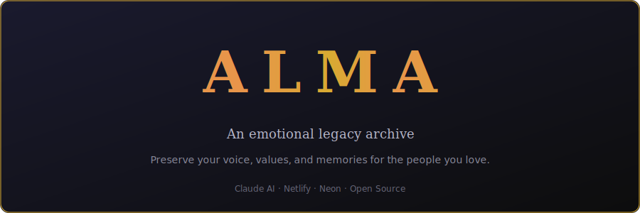

<p align="center">
  
</p>

<p align="center">
  <a href="https://alma-demo.netlify.app"></a>
  <a href="https://projeto-alma.netlify.app"></a>
</p>

<p align="center">
  <a href="LICENSE"></a>
  
  
  
  
</p>

<p align="center">
  <a href="README.pt-BR.md">Leia em Portugues</a> ·
  <a href="https://alma-demo.netlify.app">Try the Demo</a> ·
  <a href="#quick-start">Quick Start</a> ·
  <a href="#contributing">Contributing</a>
</p>

---

## What is ALMA?

ALMA is a platform that lets you preserve your voice, values, and memories for the people you love — so they can talk to you even when you're no longer there.

It's not a chatbot. It's not a memorial page. It's a living archive of who you are, powered by RAG (Retrieval-Augmented Generation) and AI, that your children, partner, parents, or friends can have real conversations with — and hear answers that sound like you, because they're built from your own words.

**Think of it as a backup of your soul.**

### Try it now

> **[alma-demo.netlify.app](https://alma-demo.netlify.app)** — Login: `Lucas` / `demo123`
>
> The demo uses fictional data (a character named Rafael Mendes). No real personal information.

---

## The Story Behind ALMA

ALMA was built by a father.

Mauricio grew up with an absent father in Brazil. He broke the cycle. Became a police chief. Raised three sons with the kind of presence he never received.

But presence has an expiration date. So he started writing. Over 16 months, he produced 74 documents — more than 100,000 words — documenting everything: his values, his mistakes, his faith, his fears, what he learned about love, about pain, about being a man. Raw. Unfiltered. Real.

Then he built ALMA — a system where his sons can ask him anything, anytime, and get answers rooted in his actual words and memories. Not generic AI responses. His voice.

Then he decided to give it to the world.

**ALMA is free. ALMA is open source. Because every father, every mother, every person who wants to leave something real behind deserves the tools to do it.**

---

## What Makes ALMA Different

| Feature | ALMA | Typical "memorial" tools |
|---|---|---|
| **Conversations** | Real-time AI chat based on your actual words | Pre-recorded video clips |
| **Context-aware** | Adapts tone per person (child vs. partner vs. parent) | Same content for everyone |
| **Self-correcting** | Author can correct AI responses in real-time | Static, no feedback loop |
| **Content moderation** | AI-powered moderation on all user inputs | None |
| **Searchable memory** | Full-text search across all memories (RAG) | Manual browsing only |
| **Directive system** | Per-person behavioral rules for the AI | No customization |
| **Multi-language** | i18n ready (PT-BR, EN, ES — add your own) | Single language |
| **Free & open** | MIT License, zero cost to run | $100+/month subscriptions |
| **Self-hosted** | Your data stays yours (Netlify + Neon free tier) | Vendor lock-in |

---

## How It Works

```
┌──────────────┐     ┌──────────────┐     ┌──────────────┐
│   Your Son   │────▶│  ALMA Chat   │────▶│  Claude AI   │
│  asks a      │     │  (Frontend)  │     │  (Anthropic) │
│  question    │     └──────┬───────┘     └──────▲───────┘
└──────────────┘            │                    │
                            ▼                    │
                   ┌──────────────┐     ┌──────────────┐
                   │   Netlify    │────▶│   RAG Engine  │
                   │  Functions   │     │  Search your  │
                   │  (Backend)   │     │  memories in  │
                   └──────────────┘     │  Neon DB      │
                                        └──────────────┘
```

1. **Someone asks a question** — "Dad, what do I do when I feel like I'm not enough?"
2. **ALMA searches your memories** — Full-text search with person-aware reranking
3. **Builds context** — Pulls relevant memories + corrections + directives + tone config
4. **AI responds as you** — Using your actual words as foundation, not generic responses
5. **You can correct it** — If the AI gets your voice wrong, correct it. ALMA learns.

---

## Quick Start

ALMA runs on free infrastructure. You can deploy your own instance in under 30 minutes.

### Prerequisites

- A [Netlify](https://netlify.com) account (free tier)
- A [Neon](https://neon.tech) PostgreSQL database (free tier)
- An [Anthropic](https://anthropic.com) API key (for Claude AI)
- Node.js 18+

### Setup

```bash
# 1. Clone the repository
git clone https://github.com/mauriciompj/alma.git
cd alma

# 2. Install dependencies
npm install

# 3. Configure environment
cp .env.example .env
# Edit .env with your DATABASE_URL and ANTHROPIC_API_KEY

# 4. Initialize the database
node db/run-seed.mjs

# 5. Deploy to Netlify
npx netlify-cli deploy --prod --dir=. --functions=netlify/functions
```

### First Steps After Deploy

1. Open your ALMA site
2. Log in as admin
3. Start adding your memories — write about your values, your stories, your mistakes, your love
4. Share the login with the people you want to talk to
5. Correct the AI when it doesn't sound like you — ALMA learns from every correction

---

## Architecture

```
alma/
├── index.html              # Dashboard / home
├── chat.html               # Chat interface
├── admin.html              # Admin panel (memories, corrections, directives)
├── login.html              # Authentication with i18n
├── css/
│   ├── style.css           # Main styles
│   └── admin.css           # Admin panel styles
├── js/
│   ├── alma.js             # Chat engine + correction system + directives
│   └── i18n.js             # Internationalization system
├── netlify/
│   └── functions/
│       ├── auth.mjs        # Auth with bcrypt + auto-migration
│       ├── chat.mjs        # RAG chat engine with person-aware reranking
│       └── memories.mjs    # Memory CRUD + corrections + directives + moderation
├── locales/
│   ├── en.json             # English
│   ├── es.json             # Spanish
│   └── pt-BR.json          # Portuguese (Brazil)
├── db/
│   ├── seed.sql            # Database schema
│   ├── run-seed.mjs        # Schema runner
│   ├── seed-demo.sql       # Demo data (fictional)
│   ├── run-seed-demo.mjs   # Demo seeder
│   └── backup.mjs          # Database backup to JSON
├── docs/
│   └── banner.svg          # README banner
├── netlify.toml            # Netlify config (redirects, headers, security)
└── package.json
```

### Tech Stack

- **Frontend**: Vanilla HTML/CSS/JS — no framework, no build step, fast everywhere
- **Backend**: Netlify Functions (serverless) with ESBuild bundling
- **Database**: Neon PostgreSQL (serverless) with full-text search in Portuguese
- **AI**: Anthropic Claude (Sonnet) via API
- **Security**: bcrypt password hashing, CORS lockdown, content moderation
- **Auth**: Token-based sessions stored in database
- **i18n**: JSON locale files with auto-detection (PT/EN/ES)

---

## Security

ALMA takes data protection seriously:

- **Bcrypt password hashing** — Passwords auto-migrate from plain text on first login
- **CORS lockdown** — API only responds to the configured domain
- **Content moderation** — All corrections and directives pass through AI moderation before saving
- **Sensitive data removed from code** — Children's psychological profiles stored in DB only, not in source code
- **Database isolation** — Demo and production use completely separate databases

---

## For Developers

### Key Concepts

- **Chunks**: Your memories are stored as searchable text chunks in PostgreSQL with `tsvector` indexing
- **RAG**: When someone asks a question, ALMA searches for relevant chunks using full-text search, then injects them as context for the AI
- **Person-aware reranking**: Memories tagged with the current person's name get boosted in search results
- **Corrections**: If the AI gets something wrong, the author corrects it. Corrections are injected into future prompts with highest priority
- **Directives**: Per-person or global behavioral rules (e.g., "Never compare Noah with his brothers")
- **Person Context**: ALMA adapts its tone based on who's talking — a child hears "Dad", a sibling hears "bro", a mother hears "son"

### Adding a New Language

1. Copy `locales/en.json` to `locales/your-language.json`
2. Translate all strings
3. Submit a pull request

That's it. The community can help translate ALMA into every language on Earth.

---

## Contributing

ALMA is bigger than one person. We welcome contributions of all kinds:

- **Translations** — Help ALMA speak your language
- **Code** — Bug fixes, new features, performance improvements
- **Documentation** — Guides, tutorials, how-tos
- **Stories** — Share how you're using ALMA (with permission)

See [CONTRIBUTING.md](CONTRIBUTING.md) for guidelines.

---

## Roadmap

- [x] Core chat with RAG memory search
- [x] Per-person tone adaptation
- [x] Correction system (human-in-the-loop)
- [x] Directive system (per-person + global)
- [x] Admin panel for memory management
- [x] Multi-language support (PT/EN/ES)
- [x] Bcrypt auth + CORS lockdown
- [x] Content moderation (AI-powered)
- [x] Person-aware memory reranking
- [x] Demo site with fictional data
- [x] Age-aware responses (adapts tone to child's current age)
- [x] Conversation history (persistent, saved per person)
- [x] PWA support (installable, offline-capable)
- [ ] Self-hosted AI mode (Ollama/LM Studio) — [see proposal](docs/issue-ollama-integration.md)
- [ ] Voice synthesis (hear ALMA in the author's actual voice)
- [ ] One-click setup wizard
- [ ] Import from journals, WhatsApp exports, voice memos
- [ ] "Letter mode" — scheduled messages for future dates

---

## License

MIT License — free for everyone, forever. See [LICENSE](LICENSE).

---

## A Final Word

> *"I fix what I inherited. I deliver what I never received."*

ALMA started as one father's promise to his three sons. It became something bigger — an invitation for anyone who wants to leave behind more than photos and possessions.

Your voice matters. Your story matters. Your mistakes and your love and your values — they matter.

ALMA gives you the tools to make sure they're never lost.

---

<p align="center">
  Built with love by <a href="https://github.com/mauriciompj">Mauricio Maciel Pereira Junior</a><br>
  Police Chief. Father of three. Patch that fixed the broken code.
</p>
