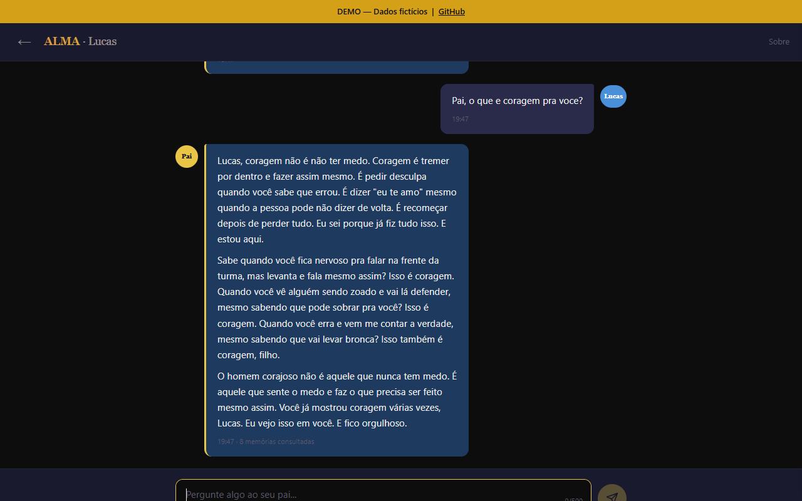

<p align="center">
  <h1 align="center">ALMA</h1>
  <p align="center"><strong>A sua voz, guardada no tempo.</strong></p>
  <p align="center">Plataforma open source de legado emocional com inteligência artificial.</p>
  <p align="center">
    <a href="README.md">Read in English</a> ·
    <a href="README.es.md">Lee en Español</a> ·
    <a href="#início-rápido">Início Rápido</a> ·
    <a href="#como-funciona">Como Funciona</a> ·
    <a href="#contribuindo">Contribuindo</a>
  </p>
</p>

---

<p align="center">
  
  <br>
  <em>"Pai, o que é coragem pra você?" — O ALMA responde usando memórias reais, adaptando o tom à idade.</em>
</p>

---

## O que é o ALMA?

ALMA é uma plataforma que permite preservar sua voz, seus valores e suas memórias para as pessoas que você ama — para que elas possam conversar com você mesmo quando você não estiver mais presente.

Não é um chatbot. Não é uma página memorial. É um arquivo vivo de quem você é, alimentado por RAG (Retrieval-Augmented Generation) e IA, onde seus filhos, companheira, pais ou amigos podem ter conversas reais — e ouvir respostas que soam como você, porque são construídas a partir das suas próprias palavras.

**Pense nisso como um backup da sua alma.**

---

## A História por Trás do ALMA

O ALMA foi construído por um pai.

Maurício cresceu com um pai ausente. Quebrou o ciclo. Virou delegado de polícia. Criou três filhos — Noah, Nathan e Isaac — com a presença que ele nunca recebeu.

Mas presença tem prazo de validade. Então ele começou a escrever. Em 16 meses, produziu 74 documentos — mais de 100 mil palavras — registrando tudo: seus valores, seus erros, sua fé, seus medos, o que aprendeu sobre amor, sobre dor, sobre ser homem. Cru. Sem filtro. Real.

Depois construiu o ALMA — um sistema onde seus filhos podem perguntar qualquer coisa, a qualquer hora, e receber respostas baseadas nas palavras e memórias reais dele. Não respostas genéricas de IA. A voz dele.

Não tinha diploma de TI. Largou duas faculdades de computação. Construiu mesmo assim — mais de 5.700 linhas de código, do zero.

Depois decidiu dar pro mundo.

**ALMA é gratuito. ALMA é open source. Porque todo pai, toda mãe, toda pessoa que quer deixar algo real merece as ferramentas pra fazer isso.**

---

## O que Diferencia o ALMA

| Recurso | ALMA | Ferramentas "memoriais" tradicionais |
|---|---|---|
| **Conversas** | Chat em tempo real com IA baseado nas suas palavras | Clips de vídeo pré-gravados |
| **Contexto** | Adapta o tom por pessoa (filho vs. companheira vs. mãe) | Mesmo conteúdo pra todos |
| **Auto-correção** | O autor corrige respostas da IA em tempo real | Estático, sem feedback |
| **Busca inteligente** | Full-text search em todas as memórias (RAG) | Navegação manual |
| **Diretrizes** | Regras de comportamento por pessoa para a IA | Sem personalização |
| **Multi-idioma** | Pronto para i18n (PT-BR, EN, ES — adicione o seu) | Idioma único |
| **Gratuito e aberto** | Licença MIT, custo zero pra rodar | Assinaturas de $100+/mês |
| **Self-hosted** | Seus dados ficam com você (Netlify + Neon free tier) | Dependência de fornecedor |

---

## Como Funciona

```
┌──────────────┐     ┌──────────────┐     ┌──────────────┐
│  Seu filho   │────▶│  ALMA Chat   │────▶│  Claude AI   │
│  faz uma     │     │  (Frontend)  │     │  (Anthropic) │
│  pergunta    │     └──────┬───────┘     └──────▲───────┘
└──────────────┘            │                    │
                            ▼                    │
                   ┌──────────────┐     ┌──────────────┐
                   │   Netlify    │────▶│  Motor RAG    │
                   │  Functions   │     │  Busca suas   │
                   │  (Backend)   │     │  memórias no  │
                   └──────────────┘     │  Neon DB      │
                                        └──────────────┘
```

1. **Alguém faz uma pergunta** — "Pai, o que eu faço quando sentir que não sou suficiente?"
2. **ALMA busca nas suas memórias** — Full-text search em todas as suas palavras, valores e histórias documentadas
3. **Constrói o contexto** — Puxa memórias relevantes + correções + diretrizes + configuração de tom
4. **A IA responde como você** — Usando suas palavras reais como base, não respostas genéricas
5. **Você pode corrigir** — Se a IA errar seu tom, corrija. O ALMA aprende.

---

## Início Rápido

O ALMA roda em infraestrutura gratuita. Você pode deployar sua instância em menos de 30 minutos.

### Pré-requisitos

- Uma conta no [Netlify](https://netlify.com) (gratuita)
- Um banco PostgreSQL no [Neon](https://neon.tech) (gratuito)
- Uma chave de API da [Anthropic](https://anthropic.com) (para o Claude AI)
- (Opcional) Uma chave de API da [ElevenLabs](https://elevenlabs.io) (para síntese de voz)
- Node.js 18+

### Instalação

```bash
# 1. Clone o repositório
git clone https://github.com/mauriciompj/alma.git
cd alma

# 2. Instale as dependências
npm install

# 3. Configure o ambiente
cp .env.example .env
# Edite o .env com seu DATABASE_URL e ANTHROPIC_API_KEY

# 4. Inicialize o banco de dados
node db/run-seed.mjs

# 5. Deploy no Netlify
npx netlify-cli deploy --prod --dir=. --functions=netlify/functions
```

### Primeiros Passos Após o Deploy

1. Abra seu site ALMA
2. Entre como admin
3. Comece a adicionar suas memórias — escreva sobre seus valores, histórias, erros, amor
4. Compartilhe o login com as pessoas que você quer que conversem com o ALMA
5. Corrija a IA quando ela não soar como você — o ALMA aprende com cada correção

---

## Arquitetura

```
alma/
├── index.html              # Dashboard / login
├── chat.html               # Interface de chat
├── admin.html              # Painel admin (memórias, correções, diretrizes)
├── login.html              # Autenticação
├── css/
│   ├── style.css           # Estilos principais
│   └── admin.css           # Estilos do admin
├── js/
│   └── alma.js             # Motor de chat + correções + diretrizes
├── netlify/
│   └── functions/
│       ├── auth.mjs        # Autenticação (tokens de sessão)
│       ├── chat.mjs        # Motor RAG (busca → contexto → IA)
│       ├── memories.mjs    # CRUD de memórias, correções, diretrizes, importação
│       └── alma-voice.mjs  # Proxy TTS (síntese de voz via ElevenLabs)
├── locales/
│   ├── en.json             # Strings de interface em inglês
│   ├── es.json             # Strings de interface em espanhol
│   └── pt-BR.json          # Strings de interface em português
├── netlify.toml            # Configuração do Netlify
└── package.json
```

### Stack Tecnológica

- **Frontend**: HTML/CSS/JS puro — sem framework, sem build step, rápido em qualquer lugar
- **Backend**: Netlify Functions (serverless) com ESBuild
- **Banco de Dados**: Neon PostgreSQL (serverless) com full-text search configurável (`SEARCH_LANGUAGE` — suporta qualquer idioma)
- **IA**: Anthropic Claude (Sonnet) via API
- **Voz**: ElevenLabs TTS (opcional — ouça o ALMA falar)
- **Autenticação**: Sessões com token armazenadas no banco
- **i18n**: Arquivos JSON de locale, extensível para qualquer idioma

---

## Para Desenvolvedores

### Conceitos Chave

- **Chunks**: Suas memórias são armazenadas como blocos de texto pesquisáveis no PostgreSQL com indexação `tsvector`. O idioma de busca é configurável via env var `SEARCH_LANGUAGE` (`simple` para universal, `portuguese`, `english`, `spanish`, etc.)
- **RAG**: Quando alguém pergunta algo, o ALMA busca chunks relevantes via full-text search + mapeamento de tags + reranking por pessoa, e injeta como contexto para a IA
- **Correções**: Se a IA erra algo, o autor corrige. Correções são injetadas nos prompts futuros com prioridade máxima
- **Diretrizes**: Regras de comportamento por pessoa ou globais (ex: "Nunca compare o Noah com os irmãos")
- **Contexto por Pessoa**: O ALMA adapta o tom com base em quem está conversando — filho ouve "Pai", irmão ouve "mano", mãe ouve "filho"

### Adicionando um Novo Idioma

1. Copie `locales/en.json` para `locales/seu-idioma.json`
2. Traduza todas as strings
3. Envie um pull request

Só isso. A comunidade pode ajudar a traduzir o ALMA pra todos os idiomas do planeta.

---

## Contribuindo

O ALMA é maior que uma pessoa. Aceitamos contribuições de todos os tipos:

- **Traduções** — Ajude o ALMA a falar seu idioma
- **Código** — Correções, funcionalidades, melhorias de performance
- **Documentação** — Guias, tutoriais, how-tos
- **Histórias** — Compartilhe como você está usando o ALMA (com permissão)

Veja [CONTRIBUTING.md](CONTRIBUTING.md) para diretrizes.

---

## Roadmap

- [x] Chat principal com busca RAG em memórias
- [x] Adaptação de tom por pessoa
- [x] Sistema de correções (human-in-the-loop)
- [x] Sistema de diretrizes (por pessoa + global)
- [x] Painel admin para gerenciamento de memórias
- [x] Suporte multi-idioma (i18n)
- [x] Bcrypt auth + CORS lockdown
- [x] Moderação de conteúdo (IA)
- [x] Reranking de memórias por pessoa
- [x] Site demo com dados ficcionais
- [x] Respostas adaptadas à idade
- [x] Histórico de conversas (persistente, por pessoa)
- [x] PWA (instalável, offline-capable)
- [x] Síntese de voz via ElevenLabs TTS
- [x] Navegador visual de memórias (BD Revisor)
- [x] Sistema de importação SQL para lotes de memórias
- [ ] IA self-hosted (Ollama/LM Studio) — [ver proposta](docs/issue-ollama-integration.md)
- [ ] Wizard de setup em um clique
- [ ] Importação de diários, exports do WhatsApp, memos de voz
- [ ] "Modo carta" — mensagens agendadas para datas futuras

---

## Licença

Licença MIT — livre pra todos, pra sempre. Veja [LICENSE](LICENSE).

---

## Uma Última Palavra

> *"Eu corrijo o que herdei. Eu entrego o que não recebi."*

O ALMA começou como a promessa de um pai pros seus três filhos. Virou algo maior — um convite pra qualquer pessoa que quer deixar pra trás mais do que fotos e bens materiais.

Sua voz importa. Sua história importa. Seus erros e seu amor e seus valores — importam.

O ALMA te dá as ferramentas pra garantir que eles nunca se percam.

---

<p align="center">
  Feito com amor por <a href="https://github.com/mauriciompj">Maurício Maciel Pereira Júnior</a><br>
  Delegado de Polícia. Pai de três. O patch que corrigiu o código quebrado.
</p>
